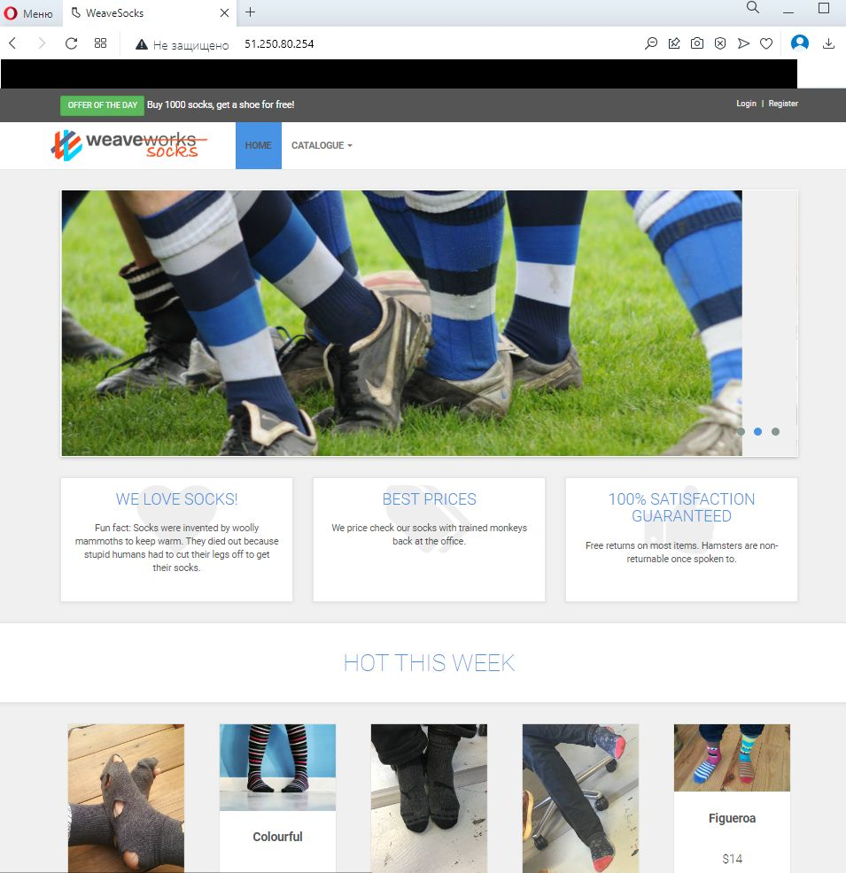

# ИТОГОВОЕ ЗАДАНИЕ (HW-03) модуля D1.7

Данные репозиторий создан для тестового развертывания интернет-магазина носков.

Для развертывания проекта в Яндекс.Облаке необходимо сделать следующее:
1. Установить и настроить на ваш хост Terraform добавив провайдера Яндекс.Облако.
2. Через команду git clone склонировать на свой хост файлы из данного репозитория.
3. После клонирования, перейти в корень проекта и отредактировать файл variables.tf, добавив в него данные своего каталога в Яндекс.Облаке.
4. Не забудьте сгенерировать ssh ключи.
5. Находясь в корне проекта инициализуйте Terraform командой terraform init.
6. Далее чтобы проверить правильность конфигурации Terraform введите команду terraform plan.
7. Если нет ошибок при исполнении команды из п.6, выполните команду terraform apply.
8. По завершении будут выведены адреса master-ноды и worker-ноды.
9. По любому из этих адресов должна отображаться главная страница интернет-магазина носков.
> Скриншот стартовой страницы:
